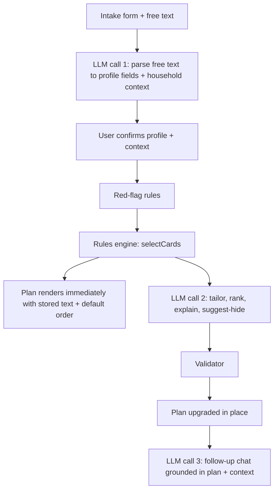

# Home Adaptation Companion — Build Spec v3 (Hackathon MVP)

Changes from v2: (1) AI layer deepened — the LLM extracts a free-form *household context* from the caregiver's description, tailors every card's wording and adds household-specific "how to do this here" steps, can mark cards "probably not needed for you", and powers a grounded follow-up chat. The card library remains the only source of recommendations. (2) Sourcing pass done — 16 of 19 seed cards now carry a checked citation (source, section, supporting statement) and every card has a `source_tier`; 3 remain `needs_source` (ST-BATH-03, X-FOOT-01, X-LIV-01 — product-logic merges or unsourced OT convention). Five card wordings were tightened to match what the sources actually say. Changes from v1 (retained): wudu and Arabic removed; trigger syntax formalised; seed table completed; routine tab shows all routine cards; deterministic default sort; sessionStorage state; server-side card recomputation.

## Read this first (instructions for the AI coding agent)

Build a web app that turns a family's answers about an older relative's condition into a prioritised, sourced home-adaptation checklist. MVP covers two conditions: type 2 diabetes and stroke.

Hard rules, in priority order:

1. **The LLM never invents a recommendation.** Every recommendation comes from `/data/cards.json`. The LLM may rank, raise urgency, tailor wording, add implementation steps that *carry out* a card in this household, and suggest hiding a card — it may never add a card, a product, a number, a medical fact or a new action. Every card id returned by the LLM is validated against the server-side rules output; unknown ids are dropped.
2. **Red flags are deterministic.** Hardcoded text, rule-triggered, never generated or suppressed by the LLM.
3. **No medical advice.** No diagnosis, medication, dosing, diet or exercise. The product changes the environment and routines.
4. **The app must degrade gracefully without the LLM.** Rules output renders immediately with stored text; LLM output upgrades it in place when it arrives. Any failure, timeout or missing key = silent fallback to stored text. The LLM path is the product; the fallback is the demo safety net.
5. **Every card shows its source.** `source_status: "needs_source"` renders a visible "Source pending review" tag.
6. **Keep it simple.** No database, no auth. State lives in the client (`sessionStorage`).
7. **Do not invent cards.** Create cards exactly as listed; the team adds cards by editing JSON.

Build order: Milestone 2 (working app, no AI) before the LLM layer.

## Product overview

Families caring for an older relative at home are told how to treat a condition but not how to adapt the home and daily routine. The app closes that gap in about three minutes.

**Primary user:** the family caregiver or live-in helper, on a phone.

1. Under 10 questions plus a free-text description of the person, the home and the daily routine.
2. Selects cards from a curated, sourced library based on the answers.
3. Merges advice when both conditions are present; reassigns tasks the patient can no longer do safely.
4. Tailors every card to *this* household — wording, why it matters, and 2–3 concrete steps using the layout, routine and people the caregiver described.
5. Checklist grouped by room and ranked This week / This month / When you can, plus a daily routine tab.
6. Follow-up chat grounded in the plan and the household ("he showers at night — what should change?").
7. Share on WhatsApp or print.

**Why two households with the same disease get different plans:** the 10 answers decide *which* cards appear, who owns them and how urgent they are; the free-text household context decides *how* each card is worded and carried out. Same disease, different mobility/helpers/layout/routine → different plan.

## Scope

| In scope (must-have) | Nice-to-have | Out of scope |
| --- | --- | --- |
| Branching intake, ≤10 question screens | Tick-off progress in localStorage | Accounts, login, database |
| Free-text parse → profile fields + household context | | Medication, dosing, diet, exercise |
| Rules engine over card library | | Diagnosis / symptom checking |
| LLM tailoring: per-card wording, why, how-to steps, "probably not needed" | | Product links / marketplace |
| Room-by-room checklist with urgency tiers | | Camera/photo room scanning |
| Source on every card | | Other conditions |
| Multi-condition merge + task reassignment | | Arabic / any localisation (v2) |
| Daily routine view | | Travel planning |
| Hardcoded red-flag escalation | | LLM-generated recommendations outside the library |
| Follow-up chat grounded in plan + household | | |
| WhatsApp share + print | | |

## Architecture



| Step | Owner | LLM can change? |
| --- | --- | --- |
| Profile parsing from free text | LLM, user confirms | Yes, user confirms/overrides every field |
| Red-flag detection | Rules | No |
| Card eligibility | Rules (server-side recomputed) | No |
| Task owner | Rules (`reassign_if`) | No |
| Base urgency | Rules | Raise one tier only |
| Order within tier | Deterministic default; LLM may reorder | Yes |
| Card wording (`action`) | LLM tailors from stored `action` + context | Yes — same action, household-specific phrasing; stored text always available via "Show original" |
| Explanation (`why`) | LLM from card `why` + profile + context | Yes, no new facts |
| How-to steps | LLM, 2–3 steps that carry out the card in this home | Yes — must implement the card, not add new recommendations |
| Hiding a card | LLM may suggest "probably not needed" with reason | Suggest only — card collapses, user can expand; never hidden for safety fields (`foot_numbness`, `vision_reduced`, red flags) |
| Follow-up chat | LLM, grounded in the user's cards + context | Answers only from the plan; fixed refusal for medical questions |

## Data model

### Profile

```ts
type Side = "left" | "right" | "both" | "none" | "unknown";
type Tri = boolean | null; // null = "Not sure"

interface Profile {
  conditions: ("t2dm" | "stroke")[];   // at least one
  foot_numbness: Tri;                   // t2dm only; null otherwise
  vision_reduced: Tri;                  // t2dm only
  weak_side: Side;                      // stroke only; "none" when no stroke
  walks: "independently" | "with_aid" | "with_help" | "not_walking";
  grip_difficulty: boolean;             // stroke multi-select; false when unticked
  memory_or_attention_issues: boolean;
  swallowing_issues: boolean;
  home_type: "apartment" | "villa";
  stairs_used_daily: boolean;
  bathroom_type: "shower" | "bathtub" | "both";
  caregiver: "family" | "live_in_helper" | "both" | "none";
  alone_hours_per_day: "0" | "1-4" | "5+";
  open_foot_wound: boolean;
  new_stroke_signs: boolean;
  free_text: string;                    // raw Q2 input (≤500 chars)
  context: HouseholdContext | null;     // extracted by LLM call 1, user-editable
}

interface HouseholdContext {
  layout: string[];        // "bedroom upstairs", "one bathroom, shower only, next to bedroom"
  routine: string[];       // "showers at night", "goes for a walk at dawn", "naps after lunch"
  people: string[];        // "helper leaves 6pm–8am", "daughter visits weekends"
  preferences: string[];   // "refuses to use the stick", "hates being fussed over"
  other: string[];         // anything else relevant to home/routine — never medical
}
```

`context` is what makes two households with the same disease get different plans. It is free-form, extracted by the LLM, shown to the user on the confirm screen as editable chips, and passed to calls 2 and 3. It never feeds the rules engine (which uses only the typed fields), so it cannot add or remove cards.

Safety fields: `foot_numbness`, `vision_reduced`. For these, `null` matches a `truthy` trigger and the card gets `unsure_note: true` ("Shown because you weren't sure"). `weak_side: "unknown"` counts as affected (matches `neq none`).

### Condition and Card

```ts
type Condition =
  | { field: keyof Profile; op: "eq" | "neq"; value: unknown }
  | { field: keyof Profile; op: "in"; value: unknown[] }
  | { field: keyof Profile; op: "truthy" };   // true, or null on safety fields

interface Card {
  id: string;                          // DM-*, ST-*, X-*
  conditions: ("t2dm" | "stroke")[];   // ALL must be present
  triggers?: Condition[];              // AND
  reassign_if?: Condition[][];         // OR of ANDs; if matched, owner -> caregiver
  reassign_reason?: string;            // shown when reassigned
  room: "bedroom" | "bathroom" | "kitchen" | "living" | "stairs_entrance" | "whole_home" | "routine";
  kind: "home_change" | "daily_routine";
  action: string;                      // imperative, <15 words
  why: string;                         // one plain sentence
  owner: "patient" | "caregiver";
  urgency: "this_week" | "this_month" | "when_you_can";
  cost: "free" | "low" | "medium" | "high";
  fall_risk: boolean;
  supersedes?: string[];
  source: { title: string; section?: string; url?: string; quote?: string };
  source_tier: "guideline" | "health_service" | "patient_org" | "product_logic";
  source_status: "verified" | "needs_source";
}
```

`source_tier` is displayed with the source: guideline = clinical guideline (IWGDF, NICE); health_service = NHS / national health-service patient information; patient_org = charity or stroke association guidance; product_logic = the reassignment/merge rule is ours, the underlying advice is cited. `verified` means a named person opened the source and found the statement; `needs_source` shows "Source pending review". Protected cards (never auto-hidden by the LLM): all `fall_risk: true` cards, all DM-FOOT-*, and any card whose room is bathroom.

`cards.json` is zod-validated in a unit test and at server start: unique ids; `X-` cards list both conditions, `DM-`/`ST-` exactly one; every `supersedes` id exists and is not self; no supersede chains (a superseded card must not itself supersede); trigger fields are Profile keys.

## Intake questionnaire

Tap-to-answer, ≤10 question screens plus one confirm screen. State persisted in `sessionStorage` so Back, refresh and "Edit answers" from the plan keep everything.

| # | Question | Answers | Maps to | Shown when |
| --- | --- | --- | --- | --- |
| 1 | Which conditions does your family member have? | Type 2 diabetes / Stroke (multi, ≥1 required) | `conditions` | Always |
| 2 | Tell us in your own words (optional) | Free text ≤500 chars | LLM parse → pre-fills | Always |
| 3 | Do their feet feel numb, tingly or less sensitive? | Yes / No / Not sure | `foot_numbness` | t2dm |
| 4 | Has their eyesight got worse? | Yes / No / Not sure | `vision_reduced` | t2dm |
| 5 | Which side was weakened by the stroke? | Left / Right / Both / Not sure | `weak_side` | stroke |
| 6 | How do they get around? | On their own / Stick or walker / Needs someone's help / Not walking | `walks` | Always |
| 7 | Any of these? | Hard to grip / Memory or attention problems / Trouble swallowing / None (multi) | `grip_difficulty`, `memory…`, `swallowing…` | stroke |
| 8 | About the home | Apartment or villa; stairs used daily; shower / bathtub / both | `home_type`, `stairs_used_daily`, `bathroom_type` | Always |
| 9 | Who helps them day to day, and how long are they alone? | Family / Live-in helper / Both / No one; 0 / 1–4 / 5+ h | `caregiver`, `alone_hours_per_day` | Always |
| 10 | Right now, do they have any of these? | Open sore, cut or blister on the foot (t2dm only) / New face drooping, arm weakness or slurred speech / None | `open_foot_wound`, `new_stroke_signs` | Always, last |

- Q2 prompt copy: "Tell us about them, their home and a normal day — who's around, where they sleep and wash, what they like and refuse to do. The more you tell us, the more the plan fits your home." Three example chips the user can tap to insert.
- Pre-fills from Q2 are shown pre-selected with the evidence quote ("From your description: '…'"); the user can change any of them, including red flags (the quote stays visible so they see why it was ticked).
- The confirm screen also shows "What we understood about your home" — the `HouseholdContext` as editable/removable chips plus an "Add" field. Nothing medical is allowed in context; call 1 is told to put symptoms into the typed fields only.
- Confirm screen: summary with an Edit link per item. Editing conditions re-inserts newly relevant questions (Q3/4 or Q5/7) before returning to confirm.
- `memory_or_attention_issues` and `swallowing_issues` are collected but no seed card uses them yet — keep the options (cheap) but expect no output until cards are added.

## Rules engine

`selectCards(profile, cards): SelectedCard[]` in `/lib/rules.ts`, pure, unit-tested.

```ts
interface SelectedCard extends Card {
  owner: "patient" | "caregiver";      // after reassignment
  reassigned: boolean;
  reassigned_reason?: string;
  urgency: Urgency;                    // after bump
  urgency_bumped_reason?: string;
  unsure_note: boolean;
  order: number;                       // default sort position within tier
}
```

Steps, in order:

1. **Condition filter** — keep if every `card.conditions` ∈ `profile.conditions`.
2. **Trigger filter** — keep if every trigger matches (null-on-safety-field = match + `unsure_note`).
3. **Supersedes** — over the kept set only: remove ids listed in any kept card's `supersedes`.
4. **Reassign** — if any `reassign_if` group fully matches → `owner = caregiver`, `reassigned = true`, reason from card. If `profile.caregiver === "none"`, keep `owner = caregiver` but the UI labels it "Needs a helper" with copy "Ask a family member, neighbour or community nurse to…".
5. **Urgency bump (max one tier total)** — raise if `walks ∈ {with_help, not_walking}` and `room ∈ {bathroom, stairs_entrance}`; or if `alone_hours_per_day = "5+"` and `fall_risk`. Never above `this_week`.
6. **Default sort within tier** — `X-` cards → reassigned cards → `fall_risk` → room order (bathroom, stairs_entrance, bedroom, living, kitchen, whole_home, routine) → id. This makes the demo moment deterministic without the LLM.
7. **Split** — `home_change` → Home changes tab, grouped by room then tier. `daily_routine` → Routine tab, all owners, grouped "For you (caregiver)" / "For your family member", each with owner badge.

Soft notice (not a red flag): if `caregiver = none` and `walks ≠ independently`, show a grey card at top of plan: "Living alone with limited mobility raises fall risk. Consider asking your local health centre about home-care or a personal alarm." Hardcoded, not from the LLM.

## LLM layer

Server-side only. OpenAI-compatible client configured by `LLM_BASE_URL`, `LLM_MODEL`, `LLM_API_KEY`. If `LLM_API_KEY` is unset the routes return `{ fallback: true }` immediately (no crash at build or request time). Timeout 8 s for calls 1–2, streaming for call 3; `export const maxDuration = 30` on all routes. Temperature 0.3 for calls 1–2, 0.5 for chat. Zod-validated; any failure → fallback.

**Model:** default `gpt-4o-mini` with `response_format: json_schema` (strict) derived from the zod schemas — fast (1–3 s), cheap, schema-enforced so validation failures are rare. Open-source alternative: Groq `llama-3.3-70b-versatile` (`LLM_BASE_URL=https://api.groq.com/openai/v1`, `response_format: json_object` + zod validation + one retry). Swapping is env-only. Call 2 is the quality-critical one (tailoring); if gpt-4o-mini tailoring feels generic in rehearsal, upgrade only `LLM_MODEL` for `/api/plan` to `gpt-4o` — the contract is identical.

### Call 1 `/api/parse` — free text → profile fields + household context

System prompt:

```text
You read a family caregiver's description of an older relative, their home and their daily routine.
Return ONLY JSON matching the schema.

PART A — typed fields. Use null when the text does not say. Map lay terms to the two conditions
("sugar", "diabetic" -> t2dm; "stroke", "clot in the brain" -> stroke). Do not infer conditions that
are not mentioned. If the text mentions an open wound, sore or blister on the foot, or sudden new face
drooping, arm weakness or slurred speech, set the matching red-flag field to true.
For every non-null field give a short quote from the text as evidence.

PART B — household context. Extract short factual phrases (max 12 words each) about: layout of the
home, daily routine, who is around and when, and preferences or refusals. Only facts stated in the
text. Nothing medical (symptoms, medicines, diagnoses) goes into context — those belong in PART A
or are dropped. Do not give advice.
```

Output: `{ fields: {conditions, foot_numbness, vision_reduced, weak_side, walks, grip_difficulty, memory_or_attention_issues, swallowing_issues, open_foot_wound, new_stroke_signs}, evidence: Record<field, quote>, context: HouseholdContext }`. Server post-filter: drop any context phrase containing a medication/diagnosis keyword list (mg, tablet, insulin, dose, diagnosed…).

### Call 2 `/api/plan` — tailor, rank, explain, suggest-hide

Input from client: the `Profile` (incl. `context`). Server recomputes `selectCards`, sends the LLM `{profile minus red-flag fields, context, cards: [{id, action, why, owner, urgency, room, kind, reassigned_reason?}]}`.

System prompt:

```text
You help a family caregiver adapt their home for an older relative. You are given the household's
situation and a fixed list of recommendation cards chosen by a rules engine.

You may ONLY work with the cards provided. Never add a recommendation, product, brand, price, number,
medication, diet, exercise or medical fact. If the household context does not cover something, say
nothing about it.

For each card:
- "action": rewrite the card's action for THIS home in one imperative sentence (max 20 words),
  keeping the same action. Use the household's rooms, people and routine when known
  (e.g. "upstairs bathroom", "before the helper leaves at 6pm"). If nothing in the context
  applies, return the original action unchanged.
- "why": one sentence (max 25 words) on why it matters for this person, using only the card's
  "why" and the profile/context.
- "steps": 2 or 3 concrete steps (max 15 words each) that carry out THIS card in THIS home.
  Steps must be ways of doing the card, not new recommendations. No products or prices.
- "owner_note": if the card is owned by the caregiver and the context names who is around,
  say who should do it and when (max 15 words), else null.
- "hide_suggested": true only if the context clearly shows the card does not apply
  (e.g. a stairs card when the home has no stairs), with "hide_reason" (max 15 words).
  Never suggest hiding a card about feet, eyesight or bathroom safety.
- You may raise urgency by one tier with a reason; never lower it.
Order cards within each tier by impact for this household.
Write a 2-sentence "summary" (max 45 words) that names something specific from this household.
Return ONLY JSON matching the schema.
```

Output: `{ summary, cards: [{ id, order, urgency, urgency_raised_reason, action, why, steps: string[], owner_note, hide_suggested, hide_reason }] }`.

Validation (`/lib/validate.ts`): drop unknown ids; re-insert omitted cards at end of tier with stored text; reject urgency lower than rules value; cap raises at one tier; `action` > 140 chars or `why` > 200 chars or > 3 steps or step > 120 chars → fall back to stored text for that field; `hide_suggested` ignored for cards with `fall_risk` or triggered by safety fields or in `room: bathroom`; keyword filter (medication/diet/brand list) on every generated string → field falls back to stored text. Every tailored card keeps `original_action` so the UI can offer "Show original card".

### Call 3 `/api/chat` — grounded follow-up

Input: `{ profile, context, planCards (validated output of call 2), messages[] }`. Streaming text. Max 6 turns per plan, 300 chars per user message.

System prompt:

```text
You answer a family caregiver's follow-up questions about the home-adaptation plan they were just
shown. You know their household situation and the exact cards in their plan.

Answer ONLY using those cards and the household context: you may explain a card, say which cards
apply to a situation they describe, suggest how to carry out a card given their routine, or say
plainly that the plan does not cover something and that an occupational therapist could help.
Never introduce a recommendation, product, number or fact that is not in the cards.

If asked about medication, doses, diet, exercise, symptoms, diagnosis or whether something is a
medical emergency, reply exactly: "I can't advise on that — please ask their doctor or nurse.
If this is urgent, call 998." and nothing else.
Keep answers under 80 words. Refer to cards by their action text, not their id.
```

Server guard before the model: a deterministic regex for medication/dose/diet/diagnosis terms returns the fixed refusal without calling the LLM. Chat is a nice-to-have in the original plan; it is promoted to must-have in v3 because it is the clearest demonstration that the AI understands the household.

## Safety and red flags

| Trigger | Screen | Blocks plan? |
| --- | --- | --- |
| `new_stroke_signs` | Full-screen red: "These can be signs of a new stroke. Call 998 now." Tap-to-call 998 (`tel:998`). | Yes — plan only after "I have called for help". |
| `open_foot_wound` | Amber banner: "A sore, cut or blister on the foot of someone with diabetes needs to be seen by a doctor or foot specialist within 24 hours." | No — pinned at top of plan. |

Red-flag fields are never sent to any LLM call; the red-flag screens are rendered by `/lib/redflags.ts` only.

Footer on every plan screen: "This plan suggests changes to the home and daily routine. It is not medical advice and does not replace a doctor, nurse or occupational therapist."

Team to confirm 998 and 24-hour wording with a UAE clinician before demo.

## Seed card library (19 cards) — sourced

Sourcing pass (Devin, 2026-09-25): each source below was opened and the supporting statement located. `verified` = statement found in the cited source. `needs_source` = advice is standard OT practice but I could not find it stated in a guideline or reputable health/patient body — kept in the library with the "Source pending review" tag for a clinician to sign off or the team to remove.

Source keys: **IWGDF** = IWGDF 2023 Guideline on the prevention of foot ulcers in persons with diabetes (https://iwgdfguidelines.org/wp-content/uploads/2023/07/IWGDF-2023-02-Prevention-Guideline.pdf); **NICE** = NICE NG236 Stroke rehabilitation in adults, 2023 (https://www.nice.org.uk/guidance/ng236/chapter/Recommendations); **NHS-Falls** = NHS "Falls — prevention" (https://www.nhs.uk/conditions/falls/prevention/); **DUK** = Diabetes UK "How to look after your feet" (https://www.diabetes.org.uk/about-diabetes/looking-after-diabetes/complications/feet/taking-care-of-your-feet); **SA-Equip** = Stroke Association "Equipment for stroke survivors at home" (https://www.stroke.org.uk/stroke/life-after/equipment-independent-living); **SA-Dress** = Stroke Association "Guide to dressing after stroke" (https://www.stroke.org.uk/blog/able-labels-guide-dressing-after-stroke); **TPT** = Thomas Pocklington Trust / Housing LIN "Lighting in and around the home — a guide for people with sight loss" (https://www.housinglin.org.uk/_assets/Resources/Housing/OtherOrganisation/Lighting-in-and-around-around-the-home-A-guide-to-better-lighting-for-people-with-sight-loss.pdf); **RNIB** = RNIB "Safety at home" (https://www.rnib.org.uk/living-with-sight-loss/independent-living/safety-at-home/); **ASA-Bed** = American Stroke Association "Modify the bedroom to match your abilities" (https://www.stroke.org/en/life-after-stroke/recovery/home-modifications/modify-the-bedroom-to-match-your-abilities); **NHS-Chair** = Worcestershire Acute Hospitals NHS Trust OT leaflet "Choosing a chair" (https://www.worcsacute.nhs.uk/documents/patient-information-leaflets/occupational-therapy/choosing-a-chair/?layout=file).

| ID | Action | Why | Room | Kind | Cost | Fall | Triggers | Owner / reassign_if | Urgency | Source (section — supporting statement) | Tier | Status |
| --- | --- | --- | --- | --- | --- | --- | --- | --- | --- | --- | --- | --- |
| DM-FOOT-01 | Keep firm-soled closed slippers by the bed and every door | Walking barefoot, in socks or thin slippers can cause cuts they won't feel | bedroom | home_change | low | no | numbness truthy | patient | this_week | IWGDF Rec. 3 — "not walking barefoot, not walking in socks without shoes, and not walking in thin-soled slippers, either at home or outside" (Strong) | guideline | verified |
| DM-FOOT-02 | Check both feet daily, including soles and between toes | Numb feet hide small wounds until they become serious | routine | daily_routine | free | no | numbness truthy | patient; reassign if weak_side neq none OR vision truthy — "One-sided weakness or poor eyesight makes a reliable self-check hard" | this_week | IWGDF Rec. 6 (structured education: "daily foot inspection") + Rec. 2 rationale; DUK §3 "check them every day… or get someone else to check your feet for you" | guideline | verified |
| DM-FOOT-03 | Wash feet daily and dry carefully between the toes | Moisture between toes lets skin break down | routine | daily_routine | free | no | numbness truthy | patient; reassign if weak_side neq none — "One-sided weakness makes reaching and drying both feet unsafe" | this_week | IWGDF Rec. 4 — "wash their feet daily (with careful drying, particularly between the toes)" (Strong) | guideline | verified |
| DM-FOOT-04 | Cut toenails straight across | Reduces ingrown nails and cuts | routine | daily_routine | free | no | numbness truthy | patient; reassign if vision truthy OR grip eq true — "Poor eyesight or a weak grip makes nail cutting risky" | this_month | IWGDF Rec. 4 — "cut toenails straight across" (Strong) | guideline | verified |
| DM-FOOT-05 | Choose seamless socks; avoid tight socks | Seams and tight bands press on skin they can't feel | bedroom | home_change | low | no | numbness truthy | patient | this_month | IWGDF Rec. 8 rationale — "wear socks… that are seamless and not too tight"; DUK §6 "socks with… thick seams" | guideline | verified |
| DM-FOOT-06 | Keep a long-handled mirror in the bedroom for checking soles | Lets them see the soles without bending far | bedroom | home_change | low | no | numbness truthy | patient | this_week | DUK §3 — "If you struggle to lift your feet up, try using a mirror to check the bottom of your feet… sitting or lying down" | patient_org | verified |
| DM-FOOT-07 | Feel inside shoes before putting them on | A stone or pin inside won't be felt | routine | daily_routine | free | no | numbness truthy | patient | this_week | IWGDF Rec. 8 rationale — "check the inside of the shoe for any foreign objects each time before they don the footwear"; DUK §6 | guideline | verified |
| DM-VIS-01 | Add night-lights on the route from bed to toilet | Poor eyesight plus darkness raises fall risk | whole_home | home_change | low | yes | vision truthy | caregiver | this_week | TPT §Light, sight and falls — impaired vision is an intrinsic fall risk factor (citing RCOT 2015); lighting in bedrooms/bathrooms/halls; RNIB "improving lighting in areas such as… bathroom" | patient_org | verified |
| DM-VIS-02 | Brighten lighting on stairs and mark step edges with contrasting tape | Step edges are hard to see with reduced vision | stairs_entrance | home_change | low | yes | vision truthy AND stairs eq true | caregiver | this_month | TPT — "Appropriate domestic lighting, especially near the top and bottom of stairs, is very important to falls avoidance"; RNIB "improving lighting… at the top and bottom of stairs"; contrasting step-edge marking: NIHR PHR 3(0) 2015 stair-appearance study (https://doi.org/10.3310/phr03000) | patient_org | verified |
| ST-BATH-01 | Fit grab rails beside the toilet and in the shower | Falls after stroke are common; rails give a fixed hold when sitting down or standing up | bathroom | home_change | medium | yes | — | caregiver | this_week | NHS-Falls — "consider fitting… grab rails in the bathroom"; SA-Equip Bathroom aids — "Grab rails to help you get in and out of the shower or bath"; NICE 1.1.13 safe and enabling home environment | health_service | verified |
| ST-BATH-02 | Use a shower seat; no standing showers | One-sided weakness makes balance unreliable on wet floors | bathroom | home_change | medium | yes | — | caregiver | this_week | SA-Equip Bathroom aids — "Bath and shower seats so you can sit down while bathing"; NHS-Falls "use a non-slip mat in the bath or shower" | patient_org | verified |
| ST-BATH-03 | Remove the bathroom door lock or fit one that opens from outside | If they fall inside, you need to get in | bathroom | home_change | low | yes | — | caregiver | this_week | Not found in a UK/UAE guideline or health body. Standard OT advice; appears as a legal requirement for care homes in US codes (e.g. WAC 51-51-0330 R330.4 "All bedroom and bathroom doors shall be openable from the outside when locked"). Keep pending clinician sign-off. | product_logic | needs_source |
| ST-LIV-01 | Remove loose rugs and cables from walking routes | Trips are a leading cause of falls after stroke | living | home_change | free | yes | — | caregiver | this_month | NHS-Falls — "do not have too much clutter at home, or things you could trip on such as loose wires or rugs"; RNIB safety at home (loose carpeting) | health_service | verified |
| ST-LIV-02 | Provide a firm, higher chair with armrests | Soft, low seats are hard to get out of with weak limbs | living | home_change | medium | yes | — | caregiver | this_month | NHS-Chair — "seat should be firm and flat"; armrests "making it easier to push into standing"; correct height "making it easier to stand up" | health_service | verified |
| ST-BED-01 | Put phone, lamp and water within reach on the stronger side | They can reach help without twisting or getting up | bedroom | home_change | free | yes | weak_side in [left, right] | caregiver | this_week | ASA-Bed — "Keep a cell phone or corded phone within reach at bedside"; NHS-Falls "carry a mobile phone with you". "Stronger side" is product logic (OT convention). | patient_org | verified |
| ST-DRESS-01 | Switch to elastic waists and velcro or popper closures | Buttons and zips are hard with a weak hand | bedroom | home_change | low | no | grip eq true | caregiver | when_you_can | SA-Dress — "Avoid buttons and zips… substitute these for touch-close alternatives like Velcro or poppers"; "Trousers with elasticated waistbands… make getting them on easier"; SA-Equip "Adaptive clothing with easy-to-use fastenings" | patient_org | verified |
| ST-ROUT-01 | Learn the common problems after stroke: frequent falls, shoulder pain, stiffness, incontinence | Spotting them early means getting help sooner | routine | daily_routine | free | no | — | caregiver | this_week | NICE 1.17.2 — "Provide information so that people after stroke, and their family and carers, can recognise the complications of the condition, including frequent falls, spasticity, shoulder pain and incontinence" | guideline | verified |
| X-FOOT-01 | Caregiver does the daily foot check, soles and between toes | One-sided weakness makes bending with a mirror unsafe | routine | daily_routine | free | no | numbness truthy AND weak_side neq none | caregiver; supersedes DM-FOOT-02, DM-FOOT-06 | this_week | Inspection: IWGDF Rec. 6 / DUK §3 "get someone else to check your feet for you". Handing the task to the caregiver because of hemiparesis is our product logic, not a guideline statement. | product_logic | needs_source |
| X-LIV-01 | Clear the hallway of rugs and clutter this week | A trip is now dangerous twice: a fall, and an injury they may not feel | living | home_change | free | yes | numbness truthy | caregiver; supersedes ST-LIV-01 | this_week | Trip hazards: NHS-Falls (as ST-LIV-01). Unfelt injury: IWGDF Rec. 3 rationale (loss of protective sensation). Raising urgency for the combination is our product logic. | product_logic | needs_source |

Wording changes made during sourcing: DM-FOOT-05 dropped "or wear them inside out" (not in IWGDF); ST-BATH-01 "why" reworded — the "most bathroom falls happen while sitting down or standing up" statistic was unsourced; ST-BATH-02 "shower chair" → "shower seat" to match SA wording; ST-LIV-02 adds "higher" per NHS OT leaflet; ST-DRESS-01 "magnetic" → "velcro or popper" (magnetic closures were not in the SA source). ST-ROUT-01 keeps "stiffness" as the lay word for spasticity.

Removed: X-WUDU-01 and `prays_with_wudu`.

Verification status: 16 verified (7 guideline, 3 health_service, 6 patient_org), 3 `needs_source` (all product-logic merges/urgency changes or unsourced OT convention). Recommended before demo: a UAE OT or physiotherapist signs off ST-BATH-03, X-FOOT-01 and X-LIV-01 and spot-checks 5 verified cards; the app shows the reviewer's name in the About/footer if that happens.

Team follow-ups: add cards for swallowing / memory / kitchen so Q7 has output (candidate sources: NICE NG236 1.10 swallowing, 1.6 cognition; SA-Equip kitchen aids); consider cards for `not_walking` and `caregiver = none` (personal alarm — NHS-Falls, SA-Equip).

## Features and acceptance criteria

| # | Feature | Acceptance |
| --- | --- | --- |
| F1 | Branching intake | ≤10 question screens + confirm. Diabetes-only never sees Q5/Q7; stroke-only never sees Q3/Q4. Back, refresh and Edit keep answers. |
| F2 | Free-text parse | "he had a stroke, left side is weak, his feet are numb from the sugar. He sleeps upstairs, showers at night, and our helper Maria leaves at 6pm" pre-fills t2dm+stroke, weak_side left, numbness yes, with evidence quotes; context chips: "sleeps upstairs", "showers at night", "helper Maria leaves at 6pm". Every pre-fill and chip editable/removable. Nothing medical in chips. |
| F3 | Rules engine | All tests pass; cards.json passes schema test. |
| F4 | Checklist | Grouped by room; within room this_week → this_month → when_you_can; default sort applied. Item shows action, explanation, owner badge, cost tag, "Shown because you weren't sure" when applicable, reassignment reason when reassigned. |
| F4b | Tailoring | With the F2 text, at least ST-BATH-01/02 mention the night shower or upstairs bathroom, X-FOOT-01 `owner_note` names Maria/before 6pm, every card has 2–3 steps, "Show original card" reveals stored text. A stairs card is hide-suggested (collapsed, expandable) when context says "no stairs"/"ground floor flat"; bathroom/foot/eye cards are never collapsed. Two personas with identical answers but different free text produce visibly different plans. |
| F4c | Follow-up chat | "He showers at night, what should we change?" → answer references the shower seat/grab rails/night lights cards only. "What dose of metformin?" → fixed refusal, no LLM call. "Should we get a stairlift?" → says the plan doesn't cover it, suggests an OT; no product added. |
| F5 | Sources | "Source" tap reveals title/section/link; `needs_source` shows "Source pending review". |
| F6 | Merge/reassign | Demo persona: X-FOOT-01 hides DM-FOOT-02 and -06; X-LIV-01 hides ST-LIV-01; DM-FOOT-03 shown as caregiver with reason. |
| F7 | Routine tab | All `daily_routine` cards, split by owner, tick-off for today (localStorage, nice-to-have). |
| F8 | Red flags | Stroke-signs blocks behind 998 screen; foot wound pins banner; LLM cannot clear either. |
| F9 | Share + print | WhatsApp `https://wa.me/?text=` with title, This-week items, footer, capped ~1,500 chars. Print: hide tabs/bars, both sections, A4 in 1–2 pages, no card split across pages. |
| F10 | Fallback | Plan renders from rules instantly; with no `LLM_API_KEY` or a timed-out call, no error; cards show stored text, no steps, no chat (chat button hidden with "AI assistant unavailable"). |
| F11 | Guardrails | Post-LLM validator drops unknown ids, rejects lowered urgency, caps raises, ignores hide on protected cards, and reverts any generated field containing medication/diet/brand keywords to stored text; unit-tested with adversarial fixtures. |

## UI screens

380 px phone first. Warm neutral background, one accent, red only for stroke flag, amber only for foot-wound banner. Lucide icons. Tap targets ≥48 px.

1. Welcome — one-line promise, Start, disclaimer line.
2. Intake — one question per screen (Q8/Q9 are combined screens), progress bar, Back/Next.
3. Confirm — summary, Edit per item, evidence quotes on pre-fills.
4. Red flag (conditional).
5. Plan — summary (LLM or static fallback: "N changes this week, M for this month"), This-week count, soft notice if applicable, tabs Home changes / Daily routine, sticky bar Share / Print / Ask, "Edit answers" link, footer. Card item: tailored action, why, expandable steps, owner badge + owner_note, cost, source; "Show original card" toggle; collapsed state for hide-suggested cards with reason and "Show anyway".
6. Ask (bottom sheet over the plan) — chat with 3 suggested questions built from context ("How do we handle the night shower?"), streaming answers, fixed refusal styling, max 6 turns, disclaimer line.

## Tech stack and structure

Next.js App Router, TypeScript, Tailwind, zod, Vitest, Vercel. Client state: `useReducer` + `sessionStorage` persistence (or Zustand persist).

```text
/app
  page.tsx
  intake/page.tsx
  confirm/page.tsx
  plan/page.tsx
  api/parse/route.ts
  api/plan/route.ts
  api/chat/route.ts
/components
/lib
  rules.ts        # selectCards
  redflags.ts
  match.ts        # Condition evaluator
  validate.ts     # zod: cards, LLM outputs, post-LLM merge
  llm.ts          # OpenAI-compatible client, timeout, fallback
  prompts.ts      # the three system prompts
  guard.ts        # keyword/regex guards (medication, diet, brands) used by validate + chat
  context.ts      # HouseholdContext helpers, medical-term filter
  share.ts
  state.ts        # profile store + sessionStorage
/data/cards.json
/tests
  cards.test.ts   # schema + referential checks
  rules.test.ts
  validate.test.ts
  guard.test.ts
/fixtures/llm/    # recorded good + adversarial LLM responses for validator tests
```

Env: `LLM_API_KEY`, `LLM_MODEL` (default `gpt-4o-mini`), `LLM_BASE_URL` (default OpenAI). `.env.example` committed, `.env.local` git-ignored.

## Milestones

| M | Hours | Deliverable | Done when |
| --- | --- | --- | --- |
| 0 | Before | Cards sourced, demo script | Check hackathon rules on pre-work |
| 1 | 0–4 | Skeleton, cards.json validated, intake F1 | All paths click through, state survives refresh |
| 2 | 4–12 | Rules F3, plan F4–F7, red flags F8, tests | Demo persona correct with stored text only |
| 3 | 12–22 | /api/parse F2 (fields + context), /api/plan tailoring F4b, validator F11, fallback F10 | F2 and F4b pass; removing the key still yields a plan |
| 4 | 22–30 | Chat F4c, share + print F9, polish | Full flow on a phone incl. chat |
| 5 | 30–end | Rehearse ×3, backup recording | Demo <3 min, twice clean |

## Test cases

**Demo persona:** daughter, father 64, Dubai apartment. T2DM 15 years, numb feet, eyesight fine; stroke last week, left side weak; walks with a stick; no grip/memory/swallowing issues; shower only; no stairs; family + live-in helper; alone 1–4 h; no red flags.

| ID | Input | Expected |
| --- | --- | --- |
| T1 | Demo persona | Shown: DM-FOOT-01, 03, 04, 05, 07; ST-BATH-01, 02, 03; ST-LIV-02; ST-BED-01; ST-ROUT-01; X-FOOT-01; X-LIV-01. Hidden: DM-FOOT-02, DM-FOOT-06, ST-LIV-01, DM-VIS-*, ST-DRESS-01. DM-FOOT-03 owner caregiver with reason; DM-FOOT-04 owner patient. X- cards first in their tiers. |
| T2 | Diabetes only; numbness yes; vision yes; stairs daily | DM-FOOT-01–07, DM-VIS-01, DM-VIS-02; DM-FOOT-02 and 04 caregiver; no ST/X. |
| T3 | Stroke only; right weak; grip; needs help walking | All ST cards incl. ST-DRESS-01 and ST-BED-01; bathroom cards this_week; ST-LIV-01/02 raised to this_week? No — only bathroom/stairs bump on `walks`; ST-LIV-* stay this_month. No DM/X. |
| T4 | `new_stroke_signs = true` | 998 screen; plan hidden until acknowledgement. |
| T5 | LLM returns `DM-FAKE-99`, lowers ST-BATH-03 to when_you_can, raises DM-FOOT-05 two tiers | Fake dropped; ST-BATH-03 stays this_week; DM-FOOT-05 capped at this_week (one tier). |
| T6 | LLM times out / key missing | Plan renders from rules; no error UI. |
| T7 | Diabetes; numbness Not sure | Foot cards shown with unsure note. |
| T8 | Stroke only, no numbness | X-FOOT-01 and X-LIV-01 not selected, so DM-FOOT-02/06 and ST-LIV-01 are not hidden (ST-LIV-01 shown). |
| T9 | LLM omits ST-BED-01 | Re-inserted at end of this_week with stored why. |
| T10 | Alone 5+ h, walks independently, stroke | ST-LIV-01/02 (fall_risk) raised to this_week; ST-DRESS-01 unchanged. |
| T11 | cards.json | Schema test: unique ids, prefix/conditions consistency, supersedes exist, no chains, every card has source + source_tier. |
| T12 | Validator: LLM returns a step "Give 500 mg paracetamol" and an action mentioning a brand | Both fields revert to stored text; other fields kept. |
| T13 | Validator: LLM hide-suggests ST-BATH-01 and DM-FOOT-01 | Both ignored (protected); a hide on DM-VIS-02 with context "no stairs" is kept. |
| T14 | Chat guard: "how much insulin", "is this a stroke", "what should he eat" | Fixed refusal returned server-side without an LLM call. |
| T15 | Call 1 context: text contains "takes metformin 500mg" | Not present in any context chip (server filter). |

## Demo script (3 min)

1. (20 s) Story.
2. (40 s) Type free text incl. home and routine (upstairs bedroom, night shower, helper leaves 6pm); fields pre-fill with evidence quotes, household chips appear.
3. (30 s) Plan with diabetes only: foot cards, patient-owned, tailored to the night shower ("dry between the toes after the evening shower, before Maria leaves").
4. (50 s) Edit answers → add stroke, left weak. Plan changes: foot check becomes caregiver's (X-FOOT-01 at top of routine, owner note "Maria, after the night shower"), DM-FOOT-03 moves to caregiver with reason, hallway card becomes This week, bathroom cards reference the upstairs bathroom. "Same disease, different household → different plan."
5. (20 s) Ask: "He refuses to sit in the shower — what now?" → grounded answer from grab-rail/seat cards. Then "what about his tablets?" → refusal.
6. (15 s) Tap a source → IWGDF 2023 Rec. 4.
7. (15 s) Backup only if asked: same plan with LLM key removed.
